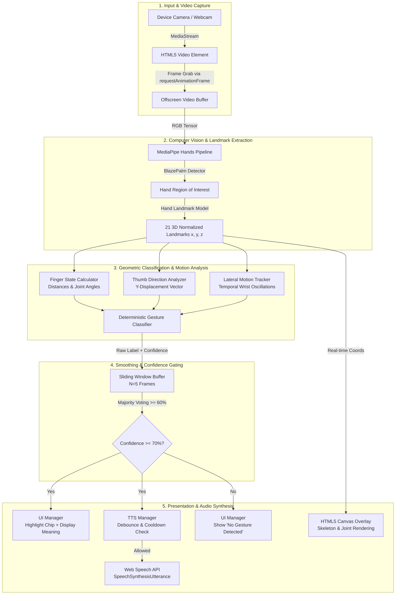

# ✋ Hand Gesture Recognition – Real-Time AI System

A production-grade, client-side, real-time **AI-powered Hand Gesture Recognition** web application. It uses computer vision to detect 21 hand landmarks directly from a device camera, classifies everyday hand gestures using 3D vector geometry and motion heuristics, displays their meanings on a responsive dashboard, and speaks them aloud using the Web Speech Text-to-Speech API.

Zero server-side inference. Runs 100% locally in the browser with hardware acceleration via WebAssembly and WebGL.

---

## 📑 Table of Contents

- [Supported Gestures](#-supported-gestures)
- [System Architecture](#-system-architecture)
- [Technical Stack & Technologies](#-technical-stack--technologies)
- [Computer Vision & Landmark Model](#-computer-vision--landmark-model)
- [Gesture Classification Engine & Mathematics](#-gesture-classification-engine--mathematics)
- [Temporal Smoothing & Stability Buffer](#-temporal-smoothing--stability-buffer)
- [Audio & Speech Synthesis Pipeline (TTS)](#-audio--speech-synthesis-pipeline-tts)
- [Frontend Architecture & UI Design System](#-frontend-architecture--ui-design-system)
- [Project Structure](#-project-structure)
- [Getting Started & Local Setup](#-getting-started--local-setup)
- [Browser Compatibility & Hardware Requirements](#-browser-compatibility--hardware-requirements)
- [License](#-license)

---

## ✋ Supported Gestures

The engine is calibrated for the following 9 everyday gestures:

| # | Hand Gesture | Meaning Displayed & Spoken | Detection Technique |
|---|---|---|---|
| 1 | 👍 Thumbs Up | **"Okay"** | Extended thumb pointing upward, 4 fingers curled |
| 2 | 👎 Thumbs Down | **"No"** | Extended thumb pointing downward, 4 fingers curled |
| 3 | ✌️ Peace / V Sign | **"Victory"** | Index + middle fingers extended, ring + pinky curled |
| 4 | 👌 OK Sign | **"Good"** | Thumb tip + index tip touching (circular form), others extended |
| 5 | ✋ Open Palm | **"Stop"** | All 5 fingers extended, static hand position |
| 6 | 👋 Waving Hand | **"Hello"** | Open palm with lateral oscillating wrist motion |
| 7 | 🤙 Call Me | **"Call Me"** | Thumb + pinky extended, 3 middle fingers curled |
| 8 | ☝️ One Finger Up | **"Wait"** | Index finger extended vertically, others curled |
| 9 | 🤞 Crossed Fingers | **"Good Luck"** | Index + middle fingers overlapping/close, others curled |

---

## 🏗️ System Architecture



---

## 🛠️ Technical Stack & Technologies

### Core Technologies

| Technology | Purpose | Implementation Detail |
|---|---|---|
| **MediaPipe Hands** | Hand Detection & 3D Landmark Tracking | Google's ML pipeline running via WebAssembly (`@mediapipe/hands v0.4`) |
| **WebAssembly (WASM)** | Near-Native ML Runtime | Executes pre-trained quantized neural network models inside the browser sandbox |
| **WebGL / GPU Acceleration** | Hardware Accelerated Inference | Offloads tensor calculations to the client's GPU via WebGL shaders |
| **Web Speech API** | Client-Side Text-to-Speech (TTS) | Uses native OS speech synthesizer (`SpeechSynthesisUtterance`) |
| **HTML5 Media Capture & Streams** | Camera Access & Video Pipeline | `navigator.mediaDevices.getUserMedia` with front/rear constraints |
| **HTML5 Canvas 2D API** | Skeleton Overlay Visualisation | Hardware-accelerated dynamic vector rendering of 21 joints and 21 bones |
| **Vanilla JavaScript (ES2022 Modules)** | Application Architecture | Pure modular JS (`import`/`export`), zero compile step, zero bundle bloat |
| **Modern CSS3 Design System** | Reactive Dashboard Interface | Custom CSS properties, CSS Grid 2-column layout, Glassmorphism, Dark/Light modes |
| **Node.js + serve** | Local Development HTTP Server | Lightweight static file server for local module resolution |

---

## 🖐️ Computer Vision & Landmark Model

### Landmark Topology (21 3D Coordinates)

The tracking engine extracts 21 landmark points per hand in normalized screen coordinates $[0.0, 1.0]$:

```
        8 (INDEX_TIP)     12 (MIDDLE_TIP)     16 (RING_TIP)     20 (PINKY_TIP)
        |                  |                   |                 |
        7 (INDEX_DIP)     11 (MIDDLE_DIP)     15 (RING_DIP)     19 (PINKY_DIP)
        |                  |                   |                 |
        6 (INDEX_PIP)     10 (MIDDLE_PIP)     14 (RING_PIP)     18 (PINKY_PIP)
        |                  |                   |                 |
 4 (THUMB_TIP)  5 (INDEX_MCP)      9 (MIDDLE_MCP)     13 (RING_MCP)     17 (PINKY_MCP)
      \               \                  |                  /               /
   3 (THUMB_IP)        \                 |                 /               /
        \               \________________|________________/               /
     2 (THUMB_MCP)                       |                               /
          \                              |                              /
       1 (THUMB_CMC)                     |                             /
            \____________________________|____________________________/
                                         |
                                     0 (WRIST)
```

### ML Pipeline Steps:
1. **Palm Detection (BlazePalm)**: Runs on full video frames to locate hands via oriented bounding boxes. Single-shot detector optimized for mobile GPUs.
2. **Landmark Model**: Crops the hand region and predicts 21 3D coordinates $(x, y, z)$ with millimeter-level relative depth.
3. **Tracking vs. Detection**: Once a hand is located, the detector sleeps and the lighter landmark model tracks across frames until hand loss occurs, saving ~60% CPU cycles.

---

## 🧠 Gesture Classification Engine & Mathematics

Gesture recognition uses deterministic **vector geometry** and **kinematic heuristics** rather than static classification templates, ensuring high accuracy across varying hand sizes, skin tones, and camera distances.

### 1. Vector Distance Metric
Given two 3D landmarks $A = (x_1, y_1, z_1)$ and $B = (x_2, y_2, z_2)$:

$$d(A, B) = \sqrt{(x_2 - x_1)^2 + (y_2 - y_1)^2 + (z_2 - z_1)^2}$$

### 2. Joint Angle Calculation
The flexion angle $\theta$ at joint $B$ (e.g., PIP joint) between bone vectors $\vec{BA}$ and $\vec{BC}$:

$$\cos(\theta) = \frac{\vec{BA} \cdot \vec{BC}}{\|\vec{BA}\| \|\vec{BC}\|}$$

$$\theta = \arccos\left(\max\left(-1, \min\left(1, \frac{\vec{BA} \cdot \vec{BC}}{\|\vec{BA}\| \|\vec{BC}\|}\right)\right)\right) \times \frac{180^\circ}{\pi}$$

A finger is classified as **extended** if:
1. $d(\text{TIP}, \text{WRIST}) > d(\text{PIP}, \text{WRIST})$
2. $\theta_{\text{PIP}} > 140^\circ$ (straightened knuckle chain)

### 3. Thumb Orientation Vector
Because the thumb possesses unique circumduction mechanics:
- **Extended**: $d(\text{THUMB\_TIP}, \text{INDEX\_MCP}) > d(\text{THUMB\_IP}, \text{INDEX\_MCP})$
- **Direction**: Evaluated along normalized $Y$-axis (screen coordinates, where $Y$ increases downward):
  - $\Delta Y = Y_{\text{TIP}} - Y_{\text{WRIST}}$
  - $\Delta Y < -0.08 \implies \text{Pointing UP (Thumbs Up)}$
  - $\Delta Y > +0.08 \implies \text{Pointing DOWN (Thumbs Down)}$

### 4. OK Sign Geometry
A circular loop formed by thumb and index finger:
- Distance ratio: $d(\text{THUMB\_TIP}, \text{INDEX\_TIP}) < 0.30 \times d(\text{WRIST}, \text{MIDDLE\_MCP})$
- Middle, ring, and pinky fingers remain extended.

### 5. Crossed Fingers Proximity
- Index and middle fingers extended.
- Inter-tip distance: $d(\text{INDEX\_TIP}, \text{MIDDLE\_TIP}) < 0.20 \times \text{PalmSize}$
- Inter-DIP distance: $d(\text{INDEX\_DIP}, \text{MIDDLE\_DIP}) < 0.20 \times \text{PalmSize}$

### 6. Dynamic Waving Motion
- Hand maintains open palm state ($>4$ extended digits).
- The engine tracks wrist position $X_{\text{WRIST}}$ across a 15-frame rolling FIFO queue.
- Reversal count: Measures direction inflection points $(\Delta X_{t} \times \Delta X_{t-1} < 0)$.
- Motion amplitude: $(X_{\max} - X_{\min}) > 0.04$.
- Triggers **"Hello"** when $\ge 2$ oscillation inflection cycles occur.

---

## ⏱️ Temporal Smoothing & Stability Buffer

Raw per-frame computer vision predictions suffer from high-frequency jitter. To eliminate classification flickering:

```
Frame N-4: [Thumbs Up]
Frame N-3: [Thumbs Up]
Frame N-2: [Thumbs Up]  ===> Majority Voting Filter ===> Stable Prediction: "Thumbs Up"
Frame N-1: [OK Sign  ]       (Dominance: 80% >= 60%)     Confidence: Avg(0.91, 0.93, 0.90, 0.92)
Frame N  : [Thumbs Up]
```

1. **Sliding Window FIFO**: Stores the last $W = 5$ frames of predictions.
2. **Dominant Label Filter**: Requires $\ge 60\%$ consensus before accepting a gesture change.
3. **Confidence Gating**: The candidate must exceed the confidence threshold ($70\%$).

---

## 🔊 Audio & Speech Synthesis Pipeline (TTS)

The speech subsystem converts recognized gestures to spoken audio without continuous audio repetition.

### State Machine Rules:
1. **Speak-Once Guarantee**: When gesture $G$ is detected, it is announced exactly once.
2. **Debounce Interval**: Automatic utterances enforce a $1500\text{ ms}$ minimum cooldown.
3. **Disappearance / Re-emergence**: If the hand drops or transitions to "no gesture", the state resets; performing $G$ again will re-announce it.
4. **Manual Repeat (`🔊`)**: Users can trigger the pronunciation instantly, bypassing cooldown.
5. **Speech Synthesis Engine**:
   - Web Speech API: `window.speechSynthesis`
   - Utterance Configuration: `rate: 1.0`, `pitch: 1.0`, `lang: 'en-US'`
   - Auto-cancel: Clears previous queued utterances to eliminate lag.

---

## 🎨 Frontend Architecture & UI Design System

### 1. Two-Column Dashboard Layout
- **Left Column**: Live video viewfinder, canvas skeleton overlay, corner gesture badge, confidence bar, and action buttons.
- **Right Column (Sidebar)**: All 9 supported gestures positioned directly beside the camera feed for zero-scroll visual reference.

### 2. Real-Time Visual Feedback
- **Active Gesture Glow**: The active gesture chip in the sidebar highlights with a glowing accent border and elevation transform when detected.
- **Interactive Speech**: Clicking any chip in the sidebar pronounces its name and meaning.
- **Corner Badge**: A live glassmorphic pill floats inside the camera view showing the current gesture.

### 3. Design Tokens & Styling
- **Glassmorphism**: `backdrop-filter: blur(12px)` with semi-transparent borders.
- **Theme Engine**: Dark mode by default with dynamic light mode override via `[data-theme="light"]` and `localStorage` persistence.
- **Responsive Breakpoints**:
  - Desktop ($>960\text{px}$): 2-column grid (`1fr 360px`).
  - Mobile/Tablet ($\le 960\text{px}$): Single column layout with flexible gesture cards.

---

## 📁 Project Structure

```
├── index.html              # Semantic HTML5 markup & responsive layout
├── css/
│   └── styles.css          # Design system, CSS grid, glassmorphism, themes
├── js/
│   ├── app.js              # Orchestrator, detection loop, smoothing buffer
│   ├── camera.js           # getUserMedia wrapper, video stream, flip camera
│   ├── handDetector.js     # MediaPipe Hands WASM loader and inference pipeline
│   ├── gestureClassifier.js# 3D vector geometry, joint angles, motion detection
│   ├── gestureMap.js       # Central gesture dictionary (IDs, names, meanings, emojis)
│   ├── tts.js              # Web Speech API manager, debouncing, cooldown
│   └── ui.js               # DOM manipulation, landmark rendering, active states
├── package.json            # Local dev server script
├── .gitignore              # Ignores logs and local dependencies
└── README.md               # Technical documentation
```

---

## 🚀 Getting Started & Local Setup

### Prerequisites
- Modern browser with WebGL and camera permissions (Chrome 90+, Edge 90+, Firefox 90+, Safari 15+).
- Node.js (v16+) or Python 3 for static file serving (required for ES Module imports).

### Running Locally

```bash
# 1. Navigate to project directory
cd "ai based gesture detection system"

# 2. Start local server
npm run dev
# or
npx -y serve@latest -l 3000 -s .
```

Visit **`http://localhost:3000`** in your browser.

*Alternative (using Python):*
```bash
python -m http.server 3000
```

---

## 🌐 Browser Compatibility & Hardware Requirements

| Platform / Browser | Status | Hardware Acceleration |
|---|---|---|
| **Google Chrome / Chromium** | ✅ Fully Supported | WebAssembly + WebGL GPU |
| **Microsoft Edge** | ✅ Fully Supported | WebAssembly + WebGL GPU |
| **Mozilla Firefox** | ✅ Fully Supported | WebAssembly + WebGL GPU |
| **Apple Safari (macOS / iOS)** | ✅ Supported | Metal / WebGL |
| **Android Chrome** | ✅ Supported | Qualcomm Adreno / ARM Mali GPU |

- **Minimum Camera Resolution**: $640 \times 480$ at $30\text{ fps}$.
- **Network Requirement**: Internet connection on initial load (~5 MB WASM + model weights cached thereafter).

---

## 📄 License

MIT License. Free for commercial and non-commercial use.
